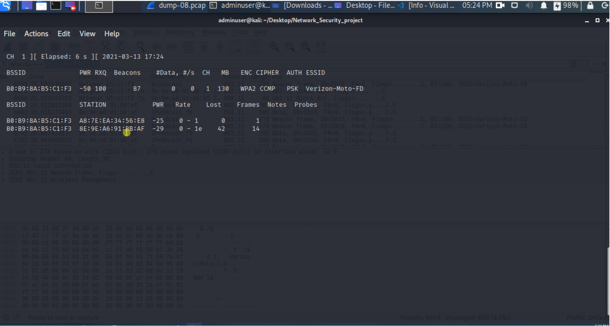
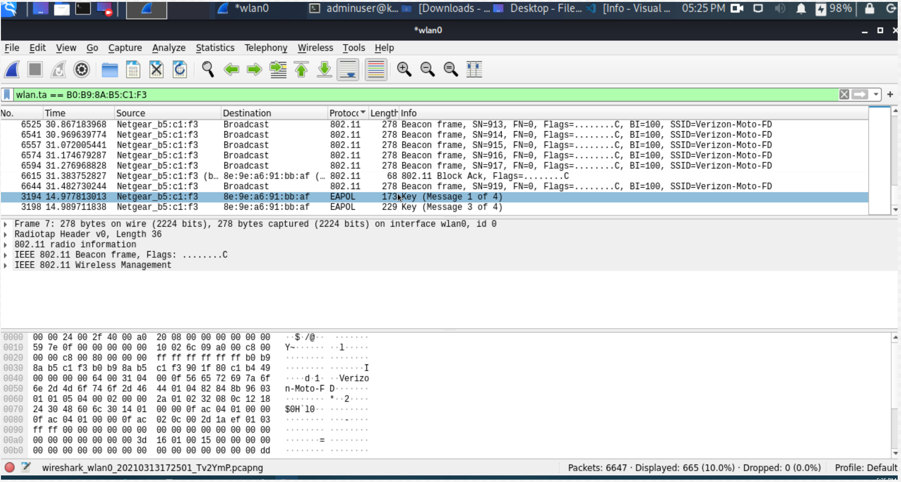
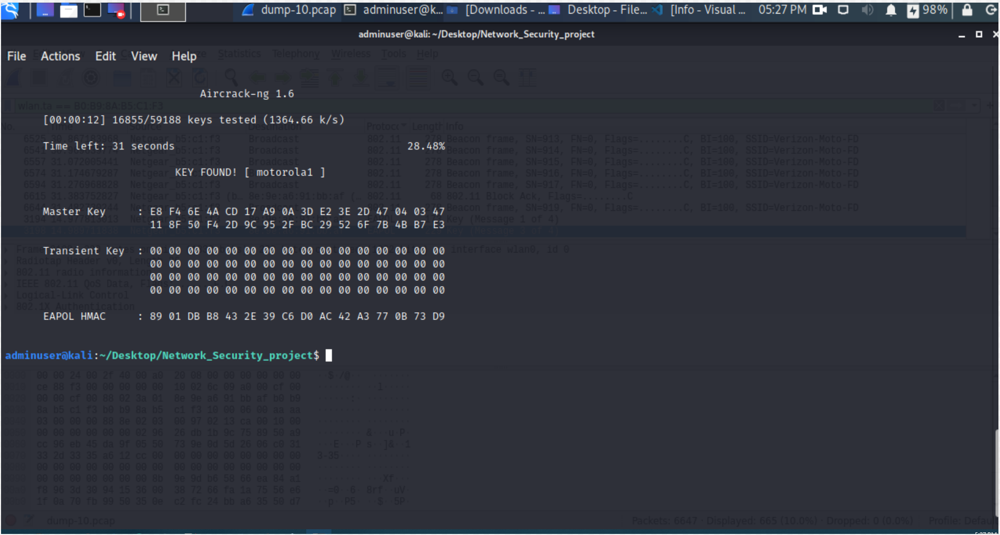

# Wireless-Pentesting
We used airodump-ng and aireplay-ng in order to perform this pen testing. 

### 1. We set up a wireless adapter which is capable of monitor mode

### 2. We can use airodump-ng to scan the wireless network to find what wireless APs uses WPA2 protocol. Using following command:

### 3. We can then use airodump-ng to to check what devices are connected to AP we are performing Pen testing. We found from previous command that it uses channel 1

### 4. We chose one device to perform deauthentication. We used aireplay-ng to disconnect one of the device connected to AP. We started running WireShark right before we executed this command so it would allow us capture the encapsulated file used over EAPOL protocol

## Below is the WireShark capture showing the EAPOL encapsulated file

### 5. Once done, we saved the the file as pcap. This capture would include the encapsulated file. 
### 6. We used aircrack-ng to perform password cracking of the encapsulated file using the dictionary list - rockyou.txt. We were able to crack the password of the AP in 12 seconds

### CONCLUSION: It is very important to use strong password for WiFi unit. It is very easy to capture the EAPOL authentication and then perform password cracking offline. It will make a lot difficult to crack a strong password. We performed dictionary attack assuming known password being used. 
### It is also beneficial to change password regularly to avoid hacking of the wireless network. 

### Below is the gif file for the Wireless Penetration testing we have performed.

